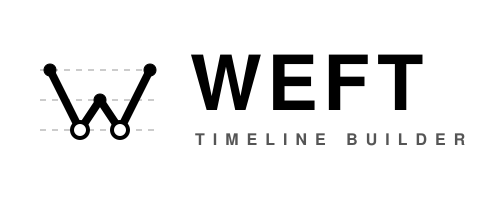

<div align="center">
  

  <p><strong>AI-native, boundaryless world-building and story timelines.</strong></p>

  <p>
    <a href="https://asinkluno.github.io/WEFT/">Documentation</a>
    ·
    <a href="https://asinkluno.github.io/WEFT/mcp/">AI &amp; MCP</a>
    ·
    <a href="https://asinkluno.github.io/WEFT/dao/">Design</a>
  </p>
</div>

WEFT lets writers build structured fictional worlds without requiring them to
write structured data by hand. Install the `weft-yaml` skill, connect the WEFT
MCP server, and tell an AI agent what should change:

> Add an event in Chapter 3 where Alice meets Bob at the station, two days
> after the hearing.

The agent finds the relevant entities and time anchors, edits the story, and
uses the real WEFT backend to validate references and resolve the timeline.
YAML remains a transparent, Git-friendly interchange format—not the interface
writers are expected to operate.

The desktop application then makes the resulting timeline, entity
relationships, and point-of-view narratives visible.

## Design

WEFT follows two equally important principles.

### AI-native

The writer expresses creative intent in natural language; the agent maintains
the precise story structure.

- The **`weft-yaml` skill** teaches agents WEFT's concepts, format, and editing
  workflow.
- The **WEFT MCP server** exposes the live schema, validation, story
  inspection, and timeline resolution backed by the same Python model as the
  desktop application.
- The **desktop application** lets writers visually inspect the result.

### Boundaryless

WEFT avoids imposing a fixed ontology on a fictional world. Its two core
primitives are deliberately broad:

- **Moai** — anything that exists in or is observed through time: a person,
  city, dynasty, sword, storm, or idea.
- **Drift** — anything that happens to or around those entities.

A Moai can carry author-defined properties, while materials can derive new
properties from them. WEFT does not prescribe character classes, factions,
location types, power systems, or other world-specific categories.

Time is open too. Gregorian dates are built in, but an **Aqueduct** plugin can
define a fictional calendar's units, carry rules, formatting, and timeline
coordinates.

**Narrative is intentionally stricter.** World-building is boundaryless, but a
novel needs a stable point of view. Each Narrative names one observer, and that
observer must be present in every selected event. A change of viewpoint is
represented explicitly with another Narrative.

## The river metaphor

WEFT's domain names describe one image: time as flowing water.

- **Dao（道）** assembles the complete path of a story.
- **Drift** comes from Confucius watching a river: “What passes is like this,
  never ceasing day or night.” Events are carried by that flow.
- **Moai** is the stone standing in the water while events pass it. `stone`
  captured the idea but was too ordinary, so WEFT uses the monumental statues
  of Easter Island as its central entity metaphor.
- **Aqueduct** channels the water, just as a calendar determines how story time
  is divided, carried, displayed, and directed.

## Install the AI skill

The `weft-yaml` skill is distributed from the
[`release`](https://github.com/asinkLuno/WEFT/tree/release) branch.

### Codex

```bash
codex plugin marketplace add asinkLuno/WEFT --ref release
codex plugin add weft-yaml@weft
```

### Claude Code

```bash
claude plugin marketplace add asinkLuno/WEFT@release
claude plugin install weft-yaml@weft
```

Start a new agent session after installing or updating the plugin. The skill
teaches the authoring workflow; connecting the MCP server additionally gives
the agent live schema access, validation, and timeline resolution. See
[AI & MCP](https://asinkluno.github.io/WEFT/mcp/) for client configuration.

## Development

Requirements: Python 3.13+, `uv`, Rust, and the Tauri prerequisites for your
platform.

```bash
uv sync
cargo tauri dev -- examples/红楼梦.yml
```

Build and validate the documentation locally:

```bash
uv run mkdocs build --strict
```

Read the full [online documentation](https://asinkluno.github.io/WEFT/) or
browse its [Markdown sources](docs/index.md).
